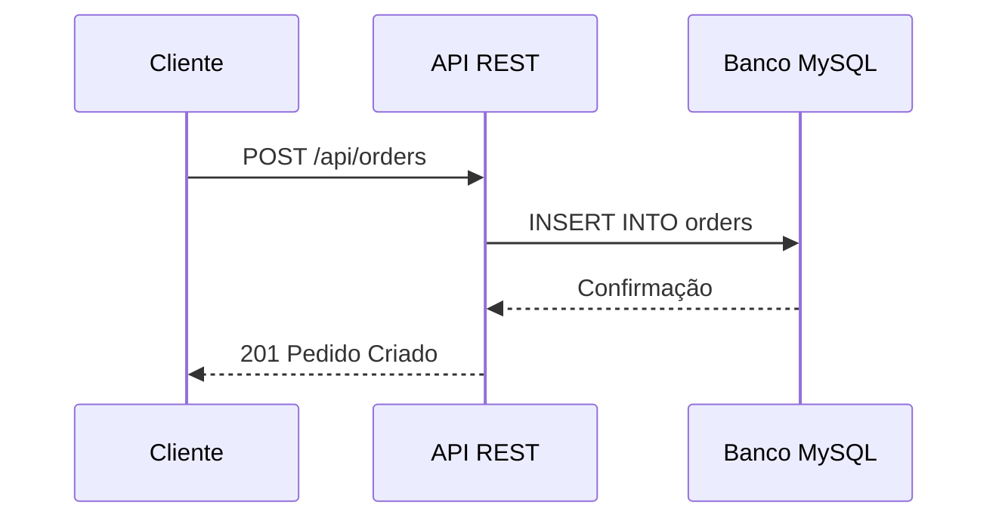
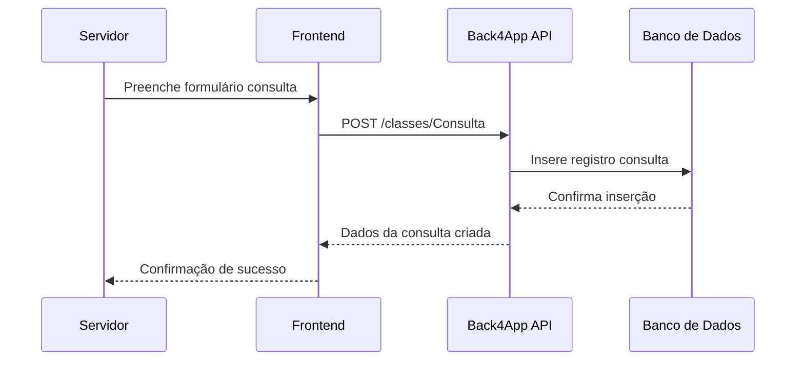

# 🏪 API de Integração - Mercado São Sebastião

## 👥 Equipe de Desenvolvimento
- Caio Henrique Felix da Silveira - 2326320 - Arquitetura geral + Desenvolvimento
- Emmanuel de Oliveira e Silva - 2325882 - Controllers e lógica de produtores
- Layza Larissa dos Santos - 2326311 - Controllers e lógica de pedidos
- Thiago da Silva Tavares - 2326278 - Modelos + Testes de integração
- Vinicius Gabriel da Justa Ximenes - 2326167 - Testes unitários + Configuração
- William Julian Lemos de Holanda - 2314705 - Docs + Postman + Diagramas

## 📋 Descrição do Projeto
API REST desenvolvida para integração entre pequenos produtores do Mercado São Sebastião de Fortaleza e consumidores locais, facilitando o comércio direto e reduzindo intermediários.

**Disciplina**: Técnicas de Integração de Sistemas (N703)  
**Instituição**: UNIFOR (Universidade de Fortaleza)  

## 🎯 Objetivo do Trabalho
Desenvolver uma API que permita a comunicação entre sistemas heterogêneos utilizando protocolos de comunicação, aplicando conceitos de desenvolvimento de APIs, documentação, testes e implementação em um contexto prático com impacto social positivo.

## 🌱 Relação com ODS 11 - Cidades e Comunidades Sustentáveis
Este projeto está alinhado com o **Objetivo de Desenvolvimento Sustentável 11**, especificamente com a meta 11.4 de fortalecer esforços para proteger e salvaguardar o patrimônio cultural e natural do mundo. Ao conectar produtores locais diretamente com consumidores, fortalecemos a economia local, valorizamos a cultura regional do **Mercado São Sebastião** e promovemos comunidades mais sustentáveis e resilientes.

## 🏗️ Arquitetura da API

### Diagrama de Arquitetura


### Tecnologias Utilizadas
- **Backend**: Node.js + Express.js
- **Banco de Dados**: MySQL
- **Autenticação**: - (API aberta para demonstração)
- **Testes**: Jest + Supertest
- **Documentação**: Postman/Insomnia

## 📊 Funcionalidades Implementadas

### ✅ Requisitos Obrigatórios Atendidos
- API integra dois sistemas distintos (Cadastro de Produtores + Sistema de Pedidos)
- Dois endpoints funcionais implementados (`/api/producers`, `/api/orders`)
- Protocolo REST/HTTP utilizado
- Tratamento de erros e exceções implementado
- Testes unitários para endpoints principais (18 testes)
- Documentação completa das rotas

### Endpoints Principais

#### Gestão de Produtores
- `GET /api/producers` - Lista todos os produtores cadastrados
- `GET /api/producers/:id` - Busca produtor específico por ID
- `POST /api/producers` - Cadastra novo produtor

#### Gestão de Pedidos
- `POST /api/orders` - Cria novo pedido vinculado a produtor
- `GET /api/orders/:id` - Busca pedido específico por ID

## 🚀 Instalação e Execução

### Pré-requisitos
- Node.js 16.x ou superior
- MySQL 5.7 ou superior
- npm ou yarn

### Configuração do Ambiente

1. **Clone o repositório**
```bash
git clone https://github.com/seu-usuario/projeto-integracao-api.git
cd projeto-integracao-api
```

2. **Instale as dependências**
```bash
npm install
```

3. **Configure o banco de dados**
```sql
CREATE DATABASE mercado_sao_sebastiao;
```

4. **Configure as variáveis de ambiente**
```bash
# Crie o arquivo .env
DB_HOST=localhost
DB_USER=root
DB_PASSWORD=sua_senha
DB_NAME=mercado_sao_sebastiao
PORT=3001
NODE_ENV=development
```

5. **Execute a aplicação**
```bash
# Desenvolvimento
npm run dev

# Produção
npm start
```

## 🧪 Testes
### Executando os Testes
```bash
# Todos os testes
npm test

# Com cobertura
npm run test:coverage

# Modo watch (desenvolvimento)
npm run test:watch
```

### Cobertura de Testes
- 18 testes implementados
- 100% de cobertura dos endpoints principais
- Testes unitários para validações e tratamento de erros

## 📡 Documentação da API
### Health Check
```http
GET /health
```
**Resposta:**

```json
{
  "status": "OK",
  "message": "API está funcionando corretamente",
  "timestamp": "2024-01-01T10:00:00.000Z"
}
```

### Listar Produtores
```http
GET /api/producers
```
**Exemplo de Resposta:**

```json
{
  "success": true,
  "count": 2,
  "data": [
    {
      "id": 1,
      "name": "Fazenda do João",
      "email": "joao@fazenda.com",
      "product_type": "Frutas",
      "price": 12.50,
      "quantity_available": 90
    }
  ]
}
```

### Criar Produtor
```http
POST /api/producers

Content-Type: application/json

{
  "name": "Novo Produtor",
  "email": "produtor@email.com",
  "product_type": "Hortaliças",
  "price": 8.75,
  "quantity_available": 50
}
```
### Criar Pedido
```http
POST /api/orders
Content-Type: application/json

{
  "producer_id": 1,
  "customer_name": "Cliente Exemplo",
  "customer_email": "cliente@email.com",
  "product_name": "Maçãs",
  "quantity": 5
}
```

🗂️ Estrutura do Projeto
```text
projeto-integracao-api/
├── src/
│   ├── config/          # Configuração do banco
│   ├── controllers/     # Lógica dos endpoints
│   ├── models/          # Modelos de dados
│   ├── routes/          # Definição das rotas
│   ├── middleware/      # Middlewares customizados
│   └── server.js        # Arquivo principal
├── tests/               # Testes unitários
├── docs/               # Documentação adicional
├── postman/            # Coleção do Postman
├── README.md           # Este arquivo
└── package.json        # Dependências do projeto
```
## 🔧 Execução via Postman
### Importando a Coleção
1. Abra o Postman/Insomnia
2. Importe o arquivo postman/collection.json
3. Configure a variável base_url para http://localhost:3001

### Sequência de Testes Recomendada
1. Health Check - Verificar se API está online
2. Listar Produtores - Deve retornar array vazio
3. Criar Produtor - Cadastrar primeiro produtor
4. Listar Produtores - Verificar se produtor foi criado
5. Criar Pedido - Fazer pedido vinculado ao produtor
6. Buscar Pedido - Verificar detalhes do pedido

## 🐛 Solução de Problemas
### Erros Comuns
- Erro de conexão com MySQL: Verifique se o MySQL está rodando
- Porta já em uso: Altere a PORT no .env para 3002, 3003, etc.
- Erro de dependências: Execute npm install novamente

### Logs de Diagnóstico
```bash
# Verificar status do MySQL
sudo systemctl status mysql

# Verificar porta
netstat -tulpn | grep :3001
```



